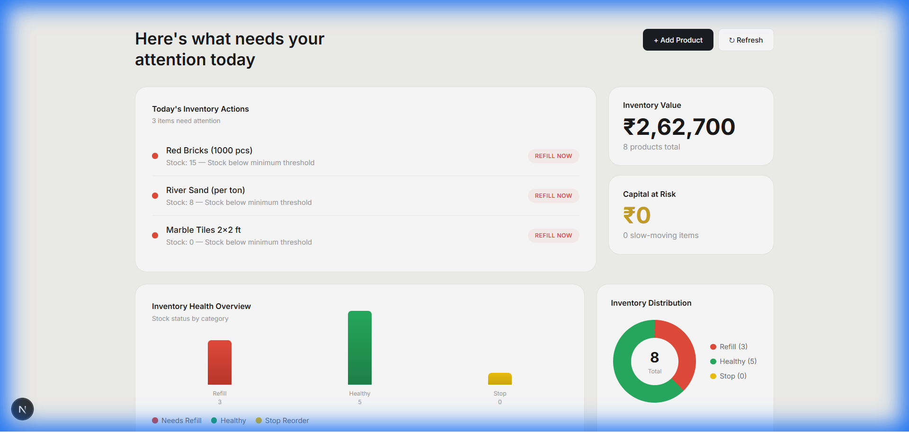

# 📦 Inventory Intelligence

> **Decision-First Inventory Management System**  
> An explainable AI-powered system that tells you *what to do*, not just *what the data says*.



---

## 🎯 Overview

Inventory Intelligence is a modern inventory management system designed for **Indian material and construction businesses**. Unlike traditional inventory systems that overwhelm users with data, this system focuses on **actionable decisions**:

- **🔴 REFILL NOW** — Stock is critically low, order immediately
- **🟢 HOLD** — Stock levels are healthy, no action needed  
- **🟡 STOP REORDER** — Low demand, avoid overstocking

### The Mental Model

> *"An internal tool that a warehouse manager checks every morning to decide what to order."*

---

## ✨ Features

| Feature | Description |
|---------|-------------|
| **Decision Engine** | AI-powered refill recommendations with explainable reasons |
| **Visual Dashboard** | Bar charts & donut charts for inventory health |
| **Real-time KPIs** | Inventory value, capital at risk, stock status |
| **Product Management** | Add products, update stock quantities |
| **Trend Analysis** | 7-day demand trends for forecasting |
| **Semantic Colors** | Red/Green/Yellow for instant understanding |

---

## 🛠️ Tech Stack

### Backend
- **Runtime**: Node.js
- **Framework**: Express.js
- **Database**: MongoDB with Mongoose ODM
- **Architecture**: MVC with Service Layer

### Frontend
- **Framework**: Next.js 14 (App Router)
- **Language**: TypeScript
- **Styling**: TailwindCSS + Custom CSS
- **Charts**: Pure CSS (no external libraries)

---

## 📁 Project Structure

```
inventory-intelligence/
├── backend/
│   ├── src/
│   │   ├── config/          # Database configuration
│   │   ├── controllers/     # Request handlers
│   │   ├── models/          # Mongoose schemas
│   │   ├── routes/          # API route definitions
│   │   ├── services/        # Business logic
│   │   ├── scripts/         # Seed data script
│   │   ├── app.js           # Express app setup
│   │   └── server.js        # Entry point
│   ├── .env.example
│   └── package.json
│
├── frontend/
│   ├── app/
│   │   ├── globals.css      # Design system
│   │   ├── layout.tsx       # Root layout
│   │   └── page.tsx         # Dashboard page
│   ├── lib/
│   │   └── api.ts           # API client functions
│   └── package.json
│
└── README.md
```

---

## 🚀 Quick Start

### Prerequisites
- Node.js 18+
- MongoDB (local or Atlas)

### 1. Clone the Repository
```bash
git clone <repository-url>
cd inventory-intelligence
```

### 2. Setup Backend
```bash
cd backend
npm install

# Create .env file
cp .env.example .env
# Edit .env with your MongoDB URI

# Seed sample data
npm run seed

# Start development server
npm run dev
```

### 3. Setup Frontend
```bash
cd frontend
npm install

# Start development server
npm run dev
```

### 4. Access the Dashboard
Open **http://localhost:3000** in your browser.

---

## 🔌 API Endpoints

### Products
| Method | Endpoint | Description |
|--------|----------|-------------|
| `GET` | `/api/inventory` | Get all products |
| `POST` | `/api/inventory` | Add new product |
| `PATCH` | `/api/inventory/:id/stock` | Update stock quantity |
| `DELETE` | `/api/inventory/:id` | Delete product |

### Decisions
| Method | Endpoint | Description |
|--------|----------|-------------|
| `GET` | `/api/refill` | Get refill recommendations |

### Analytics
| Method | Endpoint | Description |
|--------|----------|-------------|
| `GET` | `/api/analytics/trends` | Get 7-day demand trends |

---

## 📊 Decision Logic

The refill decision engine uses the following rules:

```
IF stockQuantity < minStockLevel * 0.3 AND avgDailySales > 0
  → REFILL_NOW (Critical: Stock will run out soon)

ELSE IF stockQuantity < minStockLevel
  → REFILL_NOW (Stock below minimum threshold)

ELSE IF avgDailySales === 0 AND stockQuantity > minStockLevel * 2
  → STOP_REORDER (No demand, excess stock)

ELSE
  → HOLD (Stock levels are healthy)
```

---

## 🎨 Design Decisions

1. **Decision-First UI**: Decisions are the most prominent visual element
2. **Semantic Colors**: Red = urgent, Green = healthy, Yellow = caution
3. **No Sidebar**: Clean, focused single-page layout
4. **Charts**: Pure CSS for zero dependencies
5. **Responsive**: Works on desktop and mobile

---

## 🌱 Sample Data

The seed script creates:
- **8 Products**: Cement, Steel, Sand, Bricks, etc.
- **26 Sales Records**: Realistic transaction history
- **Various Stock Levels**: To demonstrate all decision types

Run seeding:
```bash
cd backend
npm run seed
```

---

## 📋 Environment Variables

### Backend (.env)
```
PORT=5000
MONGO_URI=mongodb://localhost:27017/inventory_db
```

### Frontend
```
NEXT_PUBLIC_API_URL=http://localhost:5000
```

---

## 🚧 Future Improvements

- [ ] Authentication & user roles
- [ ] Multi-warehouse support
- [ ] Purchase order generation
- [ ] Email/SMS alerts for low stock
- [ ] Historical analytics dashboard
- [ ] Bulk import/export CSV
- [ ] Mobile app (React Native)

---

## 👨‍💻 Author

Built for **SDE Internship Assignment** — Demonstrating full-stack development with focus on practical business solutions.

---

## 📄 License

MIT License - feel free to use for learning and projects.
