# 📋 Technical deep Dive: Inventory Intelligence

This document provides an exhaustive explanation of the **Inventory Intelligence** system architecture, data logic, and operational workflows.

---

## 🏗️ 1. System Architecture

Inventory Intelligence is built on a modern **Full-Stack MERN** (MongoDB, Express, React/Next, Node) architecture, optimized for decision-making rather than just data entry.

### **Tech Stack**e construction or hardware).

### **Backend: Enterprise MVC + Service Pattern**
Unlike simple CRUD apps, our backend uses a dedicated **Service Layer** to isolate business intelligence from database operations.
-   **Config Layer**: Manages MongoDB Atlas connectivity with auto-retry logic.
-   **Model Layer**: Defines strict Mongoose schemas for data integrity.
-   **Service Layer (The Brain)**: Modular files like `stockout.service.js` or `refill.service.js` handle all heavy lifting and math.
-   **Controller Layer**: Slim wrappers that handle HTTP status codes and response formatting.
-   **Route Layer**: RESTful endpoint definitions.

### **Frontend: Next.js 14 Dashboard Architecture**
A **Single-Page Application (SPA)** dashboard built for speed and visual clarity.
-   **Component Prop Propagation**: The `darkMode` state is passed as a `dark` prop to atoms (Input, Select, Modal) for deep theme support.
-   **Client-Side Computation**: Large sorting and filtering operations are performed in memory (using `useMemo`) to provide a lag-free 60FPS UI experience.

---

## 💾 2. Data Persistence (Database Schema)

### **Product Schema (`product.model.js`)**
This is the heart of the system. Every SKU tracks:
-   `stockQuantity`: Current saleable inventory.
-   `damagedQuantity`: Items flagged as defective/unsaleable.
-   `minStockLevel`: The safety threshold (triggers reorder alerts).
-   `costPrice`: The investment per unit.
-   `sellingPrice`: The retail price.
-   `damageHistory`: A sub-document array logging `date`, `quantity`, and `reason`.

### **Sale Schema (`sales.model.js`)**
Tracks demand velocity.
-   `soldAt`: Timestamp used for 7-day and 14-day rolling window analytics.
-   `quantity`: Number of units sold (essential for calculating Average Daily Sales).

---

## 🧠 3. The "Intelligence" Layer (Business Logic)

### **A. Reorder Decision Engine (`refill.service.js`)**
The system evaluates every product against a 3-tier logical filter:

```mermaid
flowchart TD
    Start([Product Evaluation]) --> StockLow{Stock <br/> < MinStock?}
    StockLow -- Yes --> Refill["🔴 REFILL NOW <br/> (Critical)"]
    StockLow -- No --> SalesCheck{Avg Daily <br/> Sales == 0?}
    SalesCheck -- Yes --> ExcessCheck{Stock > <br/> 2x MinStock?}
    ExcessCheck -- Yes --> Stop["🟡 STOP REORDER <br/> (Stagnant)"]
    ExcessCheck -- No --> Hold["🟢 HOLD <br/> (Healthy)"]
    SalesCheck -- No --> Hold
```

1.  **IF** `stockQuantity < minStockLevel` → **REFILL NOW** (Red)
2.  **ELSE IF** `AvgDailySales == 0` AND `stockQuantity > (minStockLevel * 2)` → **STOP REORDER** (Yellow) 
    *Reason: You are sitting on too much capital for a product with no demand.*
3.  **ELSE** → **HOLD** (Green)
    *Reason: Inventory levels are balanced.*

### **B. Stock-Out Prediction Formula (`stockout.service.js`)**
We use a 14-day rolling window to predict the future:
1.  **Aggregation**: Total units sold in last 14 days.
2.  **ADS Calculation**: `Average Daily Sales (ADS) = Total Units / 14`.
3.  **Days Remaining**: `stockQuantity / ADS`.
4.  **Urgency Levels**:
    -   🚨 **Critical**: ≤ 3 days left (Stockout is imminent).
    -   ⚠️ **Warning**: ≤ 7 days left (Reorder immediately).
    -   🔍 **Attention**: ≤ 14 days left (Plan for refill).

### **C. Financial ROI Engine (`financial.service.js`)**
Calculates the health of the business capital:
-   **Unit Profit**: `Selling Price - Cost Price`.
-   **Profit Margin**: `(Unit Profit / Selling Price) * 100`.
-   **Potential Profit**: `stockQuantity * Unit Profit`.
-   **ROI Potential**: Total value of stock vs. total potential revenue.

---

## 🎨 4. Frontend & User Experience

### **Zero-Dependency Chart Injection**
Instead of using heavy libraries like Chart.js or D3, we implemented **Linear CSS-Grid Charts**:
-   **7-Day Trend**: Uses a `flex` container where the height of bars is calculated as a percentage: `(value / maxValue) * 100%`.
-   **Health Bar**: A multi-segmented horizontal bar using relative widths for Refill vs. Healthy items.

### **State Management Workflow**
The dashboard manages 15+ interconnected states:
-   **Data Sync**: All analytics (Trends, Financials, Predictions) are fetched in a single `Promise.all` block to ensure consistent timestamps.
-   **Filter Interaction**: Searching for "Cement" resets the pagination but maintains the "Sort by Stock" choice.

---

## 🔄 5. Operational Workflows

### **1. The Sale Workflow**
When you click "Record Sale":
-   **Frontend**: Opens a modal → Validates `quantity <= available stock`.
-   **API**: `PATCH /api/inventory/:id/stock` updates the product level.
-   **Analytics Sync**: The sale is logged, instantly refreshing the "ADS" and "Stockout Prediction" for that product.

### **2. The Damage Workflow**
When inventory is broken or expired:

-   **Action**: "Mark Damaged".
-   **Logic**: Quantity is subtracted from `stockQuantity` (Saleable) and added to `damagedQuantity` (Loss).
-   **Reporting**: The "Damaged Report" calculates total capital loss based on `costPrice * damagedQuantity`.
-   **Write-Off**: Permantely deletes the damaged log after accounting.

### **3. Smart Printing**
The "Print" button doesn't just print the screen. It generates a **Dynamic HTML Template** on the fly, applying professional styling (Borders, Headers, Grouping) specifically for physical auditing.

---

## 🔌 6. API Reference (Internal)

| Endpoint | Method | Role |
| :--- | :--- | :--- |
| `/api/inventory` | `GET` | Full inventory fetch |
| `/api/refill` | `GET` | Decision engine outputs |
| `/api/analytics/financial` | `GET` | ROI and Margin data |
| `/api/analytics/stockout` | `GET` | ADS and Urgency predictions |
| `/api/analytics/damaged` | `GET` | Loss reports |
| `/api/analytics/dead-stock`| `GET` | 30-day stagnant SKU detection |

---

## 🛠️ 7. Environmental Synergy

-   **Responsive Design**: The CSS uses `@media` queries with a "No-Sidebar" philosophy to ensure full-width data visibility on wide monitors.
-   **Dark Mode Propagator**: Every component uses a conditional ternary: `background: dark ? '#222' : '#fff'`. This ensures 100% theme consistency across all 8+ types of modals and overlays.
